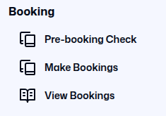

# Hotpot User Guide v3.0

*This document is accurate as of 2026/02/20. The platform is still under development, and the User Guide will be updated as new features are added.*

# Introduction

Welcome to the User Guide for HotPot, a data stewardship platform developed by the Collaborative Cash Delivery Network. The User Guide provides step-by-step instructions for accessing and using all the platform features, with screenshots to guide you through each process.

Your organisation will create an account for you. Each account can have different permissions. All accounts can [Log In](#login-page) and view the [Dashboard](#accessing-the-platform-functions). Depending on your role in your organisation, you may also have permission to use the [Booking](#how-to-manage-bookings) function, the [Deduplication](#how-to-manage-deduplication) function, the [Referral](#how-to-manage-referrals) function, or all three.

# Login Page

The first thing you see when you visit the website is the Login Page. You can log in by entering your email address and a password.

Your account will be created by an administrator in your organisation. The administrator will let you know the email address and password that you should use.

If you do not know which email and password to use, contact the administrator for your organisation.

# Accessing the Platform Functions

Once you are logged in, the first thing you will see is the Dashboard Page. You can also reach this page by clicking on the “Dashboard” button at the top of the left menu.

In the main window you will see various analytics relating to the platform. On the left side of the screen is the menu. Your organisation may give you permission to use the [Booking](#how-to-manage-bookings) function, [Deduplication](#how-to-manage-deduplication) function, or the [Referrals](#how-to-manage-referrals) function, or a combination of functions.

In the bottom left of the screen is the admin button. If you click on it, it will open a menu with the following options:

1. Go to your profile page;
2. Change the platform theme (between light and dark themes);
3. Change the platform language (depending on what languages are available);
4. Sign out of your profile.

## My Profile

On your Profile page, you can edit your First name and Last name, your email, and your password. After you make any changes, press the “Save profile” button.

In the top right corner of the screen is a button “Wipe deduplication data”. If you press this button, you will see a pop-up box asking if you are sure that you want to delete the data on your organisations account. Do not press this button unless you are 100% certain that you want to delete all the data which you have previously uploaded.

## Analytics

The Dashboard contains a range of analytics which developed with the platform users. The Dashboard has two tabs:

### Deduplication tab

This tab shows analytics relating to the deduplication function.

### Referrals tab

This tab shows analytics relating to the referrals function.

# How to manage Bookings

The Booking section of the menu on the left gives you two options:

* [Make Bookings](#make-bookings). This menu option will take you to a page where you upload your booking sheet and check if any households are already in the registry.
* [View Bookings](#view-bookings). This menu option will take you to a page where you can view all of the previous households which you have booked.

## Make Bookings

On this page you can download the Booking Template and activate the Booking Wizard to guide you through the booking process.

You need to upload your booking list in a template agreed by the Cash Working Group. You can download a copy by clicking on the “Download template” button in the top right corner.

Once your booking list is in the format provided by the template, you can click on the “Booking Wizard” button to start.

When you click on the button “Booking Wizard”, the following pop-up box will appear.

### The Booking Wizard

The Booking Wizard will take you through three steps. You must complete each step to complete the deduplication process.

#### Step 1: File Upload

When you press the button “Choose a file”, you will see the usual upload prompt which your device uses.

Choose a file from your device or from cloud storage. If you select the wrong file, you can press Remove and select another file.

Once you have selected the correct File, press “Continue” to go to the next stage of the deduplication process.

#### Step 2: File Checking

The Wizard will check if your uploaded file uses the correct template, if your data is incorrectly formatted, and if there are duplicates within the file.

If you have not used the correct template or your data is incorrectly formatted, you will see the following error message.

The Wizard will ask you to download the file in Excel format, correct any errors, and then upload the file again.

The Excel file will look exactly the same as your original file, except any errors will be highlighted in red. A new column is added to give you additional information about the error.

If your uploaded file is in the correct template, your data is correctly formatted, and there are no duplicates, the Wizard will accept the file. You should click on the “Continue” button.

#### Step 3: Registry Check

When you click on the “Continue” button, the Wizard will check the data in your uploaded file against all the data that is already stored in the platform registry.

Any households which you have uploaded which are not already in the registry, will be added to the registry. This is done automatically.

If another organisation has already booked any of your households, the Wizard will inform you and ask you to download a file in Excel format.

The Excel file will look exactly the same as your original file, except any households which have been booked by another organisation will be highlighted in red.

A new column is also added on the right which tells you which organisation has booked that household, and the scheduled end date for their assistance.

This will enable CWG members to identify when there is duplication of registration, and avoid duplication of assistance.

When you receive this information, you should update your organisation’s internal records to reflect changes to your final list.

## View Bookings

On this page you can view the bookings which your organisation has made. You cannot view the bookings made by other organisations.

You can see the National ID number of the Head of Household and Spouse, and details about duration of the assistance which you are providing them.

You can search for specific households or bookings using the search function. You can search by ID number, by activity, by start and end dates, and by date of booking.

# How to manage Deduplication

The Deduplication section of the menu on the left gives you three options:

* [Deduplication](#deduplication). This menu option will take you to a page where you upload your data and check for potential duplicates.
* [Manage Duplicates](#manage-duplicates). This menu option will take you to a page where you check and confirm potential duplicates.
* [Manage Templates](#manage-templates). This menu option will take you to a page where you can create a template that will enable you to upload your data.

Before you start to use these options, your organisation will need to establish Rules for checking duplicates. Rules are created by the administrator for your organisation, so if you want to know what rules are being used, ask your administrator. 

## Deduplication

On this page you can see who has uploaded data, the name of the file that they have uploaded, the number of duplicates in those files, and when the deduplication records were created and updated.

In the top right corner, you see a blue button which activates the Deduplication Wizard. Click on this button and the Wizard will guide you through the deduplication process.

### The Deduplication Wizard

The Deduplication Wizard will take you through three steps. You must complete each step to complete the deduplication process.

#### Step 1: File Upload

The deduplication wizard can automatically “translate” the fields from your organisation’s dataset into the standardised fields used by the platform.

In order to do this it uses a [Template](#manage-templates). Your organisation can set up one or more Templates which will act as the translation layer for your data.

This enables your organisation to use the platform without you changing any of your internal systems, making it easier to share data with others.

The Deduplication Wizard starts by asking you to select the relevant Template. Use the dropdown menu to select the Template set up by your organisation.

If you do not select a Template, you will see a message to tell you that a Template is required. You will not be able to continue until you select a Template.

If you do not see your Template in the dropdown menu, you can either contact your organisation administrator and ask them to create one, or [create a Template yourself](#manage-templates).

Once you have selected a Template, you can choose a file to deduplicate. When you press the button “Choose a file”, you will see the usual upload prompt which your device uses.

Choose a file from your device or from cloud storage. If you select the wrong file, you can press Remove and select another file.

Once you have selected the relevant Template and the correct File, press “Continue” to go to the next stage of the deduplication process.

#### Step 2: Internal File Deduplication

Your organisation may already have deduplicated your internal records, but the Wizard will check to see if there are any duplicate records within your uploaded file.

If there are any duplicate records in your uploaded file, it will tell you how many, and offer you the option to download an Excel file which shows you those duplicates.

If you press the Download button, this file will be downloaded to your device or cloud storage. You can then open the file to check and edit the duplicates on your device.

Once you have edited the duplicates on your device, you should return to Step 1 of the Wizard and upload the corrected file.

When you upload a file which contains no duplicate records, you will see a message which confirms that the platform has found no duplicate records in the file.

The Wizard will confirm that you have uploaded a file with no duplicates in it, and you can press the “Continue” button to continue to the next step.

#### Step 3: Registry Deduplication

The Wizard will add your beneficiary data to the shared Registry, and check to see if your uploaded file has any potential duplicate records with the records already held in the Registry.

If your file did not contain any duplicates, you will see the following screen. You can click the “Finish” button to close the Wizard, and you do not need to take any further action.

If your file contained duplicates, you will see the following screen. You can click the “Finish” button to close the Wizard, and then visit the “[Manage Duplicates](#manage-duplicates)” page to view and manage the potential duplicates.

## Manage Duplicates

On this page you can view and manage potential duplicates which you have uploaded. We always refer to “potential” duplicates because we cannot be sure if a record is a duplicate until we have confirmed it with our colleagues in other organisations.

The Unresolved tab will show you potential duplicates which you need to check. In order to ensure data minimization, the Registry only holds the data fields which the Data Steward has decided are necessary to check for duplicates, e.g. the data defined by specific Rules.

If you click on any row, the platform will take you to Beneficiary Preview, which shows you the details of the potential duplicate. At the top of the page you will see new information:

* The status of the duplicate (either unavailable, accepted, or rejected)
* The organisation which holds the primary record (i.e. the potential duplicate)

Under the primary record, the platform shows you the organisation which holds that record, the staff member who uploaded that record, when they uploaded it, and which fields are potential duplicates.

You can use this information to contact your colleague in the other organisation to discuss whether this is a real duplicate, and what action you will take. This is called the [Adjudication Process](#the-adjudication-process), which needs to be agreed by all participants.

Once the Adjudication Process is complete, you can change the status of the potential duplicate. In the top right corner of the Beneficiary Preview page, you will see a drop-down list entitled “Actions”.

If the Adjudication Process is successful, and your reach agreement with your colleague, you can select one of these options.

* Accepted Duplicate. You confirm with your colleague that this is a duplicate record, but both your organisations will continue to work with this beneficiary or household (perhaps because you are delivering different modalities of assistance).
* Rejected Duplicate. You confirm with your colleague that this is **not** a duplicate record, and so your organisation will become the primary record holder in the Registry.
* Delete. You confirm with your colleague that this is a duplicate record, and your organisation will no longer work with this beneficiary or household. You can delete the record from the Registry, although you may decide to keep your internal records.

If you change the status of the record to “Accepted Duplicate” or “Rejected Duplicate”, the platform will move it from the “Unresolved” tab to the “Resolved” tab. You will be able to view this record when you switch views to that tab.

### The Adjudication Process

The Adjudication Process happens off-platform, and it usually requires discussion between partner organisations. The process must be agreed by all members of the Data Steward. This is an example of an Adjudication Process which you can adapt.

1. The organisation which uploads an individual record first is considered to be the Primary record holder.
2. If another organisation uploads a record which is a potential duplicate of the Primary record, they are a Secondary record holder.
3. The Secondary record holder should contact the Primary record holder to discuss the potential duplicate.
4. Adjudication is the process of comparing the Primary record to the Secondary record, and deciding jointly if they are duplicates or not.
5. There are three possible options at the end of the process:
    1. The potential duplicate is - Not a Duplicate! *Sometimes staff make a mistake in entering data, the platform makes a mistake in flagging a record, or there are simply two individuals who have similar personal information.*
    2. The potential duplicate is a duplicate, but Unclear. If there is not enough information to decide, the record can remain flagged as a potential duplicate in the registry. This option is not preferable, and you should look for more information to make a decision!

*Should the parties involved not arrive at consensus, three members of the Oversight Committee will be invited to mediate discussions within one week.*

## Manage Templates

If you click on “Manage Templates”, the platform will take you to the Templates Page.

Most deduplication platforms require you to upload your data in a specific format. This means that you have to spend time setting up your internal systems to output that format, or manually updating your spreadsheets to fit that format.

Templates enable the platform to “translate” your spreadsheet into a common format which enables data sharing. It does this by mapping the header labels from your spreadsheet to the labels in the registry (the shared database).

Each organisation can set up its own template, and it’s possible to set up multiple templates if you need to upload data from different sources. If you click on the “Create Template” button in the top right, you will see the “Create new template” box.

Choose a simple descriptive name for your template. You should then check the labels on the left, and then enter into the “Column name” boxes on the right the labels that your organisation’s spreadsheet uses as column **headers**. For example:

* The platform uses the label “FamilyName”, while your spreadsheet might use the header label “Last Name”. Type “Last Name” into the right hand column.
* The platform uses the label “DateofBirth”, while your spreadsheet might use the label “Date of Birth”. Type “Date of Birth” into the right hand column.
* etc

You only need to enter the Column names which are needed for deduplication. These labels should have been collectively agreed by all the partners which are using the platform for deduplication.

If you are not sure which labels are being used for deduplication, you should ask the focal point in your organisation, or ask a colleague from a partner organisation who is also using the platform.

Once you have finished entering the Column names, click on the “Create template” button. 

Clicking on the name of any Template in the list will take you to the “Template Edit/Preview” page. On this page you can view the Template details, update the mapping and change the name of the Template if you need to.

# How to manage Referrals

The Referrals section of the menu on the left gives your two options:

* [Manage Received](#manage-received). This menu option will take you to a page where you can view and manage the referrals that you have received from other organisations.
* [Manage Sent](#manage-sent). This menu option will take you to a page where you can view and manage the referrals that you have sent to other organisations.

## How to create a Referral

In the right hand corner of the Manage Sent page, you can see the “New Case” button. 

If you click the button directly, the platform will take you to a separate page to make a referral. You can also Import referrals (if you already have them on your device in the agreed format), Export referrals, and Download referral templates.

This page is modelled on the existing referral form agreed by the Ukraine Response Consortium. It contains all the fields necessary to make a referral.

Once you have filled out the fields necessary to make a referral, you can also upload additional information, such as image files. This is not mandatory.

Before you can make the referral, you must verify that the beneficiary has given their consent to share their data by clicking the toggle button.

Once you have completed the form and verified that consent has been given, you will see three buttons which give you different options:

1. Save Draft. Click on this button if you have not completed the referral form, and you want to save it to edit later.
2. Send Referral. Click on this button if you have completed the referral form, and you want to send it to the receiving organisation.
3. Cancel. Click on this button if you have started the referral form, but you do not wish to finish it or save it.

## Manage Sent

On this page you can view the referrals that you have sent to other organisations, and you can create a new referral.

*The referrals that you have sent to other organisations are shown in a list. You can Search for a specific referral, or you can filter the referrals by Creator, by Step, by Recipient, by Activity, or by Date. The Actions column in the right show if you have permission to Edit or Delete the Referral.*

Above the list of referrals, you can see two Tabs: Sent, and Drafts.

### Sent Tab

The Sent tab will show you referrals that have already been sent. It shows the Case number, the organisation which the referral was Sent to, the Status of the referral, and the dates the referral was Created on and Updated on. You can also edit or delete referrals using the pen and paper icon or the trash icon on the right.

### Drafts Tab

The Drafts tab will show you referrals which you have drafted but not sent. You can edit these drafts by clicking on the Pen and Paper icon on the right.

#### How to Withdraw a Referral

While the SO has responsibility for a Case, it can edit or withdraw any referral that it has sent. The RO will be able to see that the referral has been edited or withdrawn. The SO can then delete the Referral completely, or send it to a new SO.

## Manage Received

On this page you can view the referrals that you have received from other organisations. The referrals that you have received from other organisations are shown in a Referral List.

The List shows the Case number, the organisation which is the Sender of the referral, the Status of the referral, and the dates the referral was Created on and Updated on.

### Viewing Referrals

The functions available to you on this page are:

#### Search for a specific Referral

You can search for a specific referral by typing any search term into the Search Box.

#### Filter the Referral List

Below the Search Box you will see options for filtering the referrals by different variables:

Most of these variables are easy to understand. Filter by Step is more complicated, and it is important that you understand what each Step means. You can learn more in the section below titled “[Understanding the Steps in a Referral](#understanding-the-steps-in-a-referral)”.

#### View the details of a specific Referral

If you click on any part of a line which shows a Case in the List, it will take you to a new page containing the [Individual Case Details](#individual-case-details).

#### Delete a specific Case

You can delete a Case by clicking the Trashcan icon at the end of the line.

If you click the Trashcan, you will see a pop-up box asking if you are sure.

You should not click “Confirm” unless you are absolutely certain that you want to delete the Case. Once you delete the Case, it cannot be retrieved!

#### Export a list of Referrals 

You can Export a list of Referrals by clicking the Export Referrals button in the top right corner. The list will be downloaded as an Excel file with all the details for each Case.

### Individual Case Details

The platform gives each case a unique Case Number. When you view a specific referral case, the Case Number will appear at the top of the page.

To the right of the Case Number, you can see a drop-down list and some buttons. You will use these buttons to manage the referral, and we explain each button later in this section.

Below the Case Number, you can see two Tabs: Referral, and Discussion.

#### Referral tab

The Referral Tab is the default view on this page. In the Referral Tab, you can view all the details of the Referral.

At the top you can see a visual representation of the status of the case, and how far the referral process has progressed through the Steps. You can learn more about the Steps in the section below titled “[Understanding the Steps in a Referral](#understanding-the-steps-in-a-referral)”.

#### Discussion Tab

In the Discussion tab, you can see the progress of the referral through the different steps of the process, with the dates and times given. You can also send messages, updates and requests for information to the Sending or Receiving Organisation. This ensures a record of the referral for future reference by both the Sending and the Receiving Organisation.

### Understanding the Steps in a Referral

A Referral Case goes through several Steps. These Steps are shown at the top of a page when you view an Individual Case Detail, and they will help you to understand whether the referral is making progress or has been completed.

When a Case moves to the next Step, you can change the Step by using the drop-down list in the top right of the screen for an individual Case. Select a step, click on the button “Move to Step”, and the Case will be updated. Explanations of each step are given below.

#### Under Review

The Sending Organisation (SO) sends the Referral Form to another organisation on the platform (the Receiving Organisation, or RO) because they believe that the RO can provide the support needed by the beneficiary. Once the RO receives the referral, it is labelled on the platform as **Under Review**.

#### In assessment

The RO reviews the case based on the information in the Referral Form. They will then decide whether this case is suitable for their organisation - based on whether they have the capacity, for example, or whether they still work in that location or sector. The RO will then decide whether

1. To accept the referral, in which case it will be labelled as **In** **Assessment**.
2. To reject the referral, in which case it will be returned to the SO for follow-up.

#### Registered

The RO assesses the case, perhaps sending their staff to visit the individual’s location. This assessment will check if the referral service is really needed, and if they are able to provide that service. The RO will then decide whether

1. To register the individual, in which case it will be labelled as **Registered**.
2. To reject the referral, in which case it will be returned to the SO for follow-up.

**IMPORTANT NOTE: The SO has responsibility for a Case until the RO registers the beneficiary. Once the RO registers the beneficiary, it takes formal responsibility for that case, and the SO cannot make any further changes to the referral form.**

#### Delivered

The RO will then provide the service that was requested in the referral. If the service which has been delivered is time-limited, they can mark the referral as **Delivered**. If the service is not time-limited, the RO can retain the Registered status indefinitely.

### What happens if a Referral is rejected?

If the RO decides to reject a Referral, it is returned to the SO. The RO should send a message in the Discussion tab, to explain why it has been rejected. The SO can then withdraw the Referral, and potentially send it to a new RO. The Individual Case remains on the platform unless the SO deletes it.
